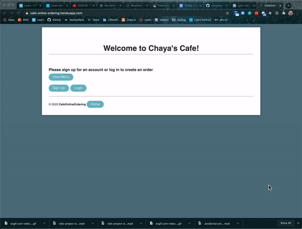

# Cafe Online Ordering

A web application using Sinatra framework with Ruby that allows for online ordering

[Demo](https://www.loom.com/share/3359523149d84c0da7f647afd8b954d1) | [Deployed app](https://cafe-online-ordering.herokuapp.com/) 

## Features

* Allows for signup/signin using authenicated password
* Once signed in, user can create a new order by adding items to order
* User can view all the orders they've created and delete orders

## Tech Used

* Ruby [2.6.1]
* Sinatra - web framework with MVC
* Postgresql - database
* Bcrypt - gem for encryption
* Dotenv - stores session secret
* Sinatra-flash - generate flash messages

## To Install

* Clone this repo to local machine `git clone <this-repo>`
* Cd into project directory and run `bundle install` to install dependencies
* Make sure Postgres app is running. To install Postgres app, go [here](https://www.postgresql.org/download/)
* Run `rake db:create` to create a database
* Run `rake db:migrate` to create tables in database
* Run `rake db:seed` to generate seed data
* Run `rake console` to open up pry console
* Run `SecureRandom.hex(64)` and copy the return value as a string
* Create a `.env` file in root directory
* Go into `.env` and write `export SESSION_SECRET=<paste SecureRandom.hex value here>` 
* Go to `.gitignore` and make sure `.env` has been added
* Run `shotgun` to run server
